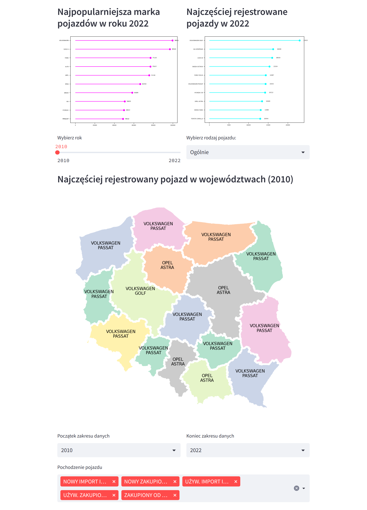

# Analysis of motorization in Poland

This project provides detailed information on motorization in Poland. All data is visualised on interactive website created with the Streamlite 
library. Plots are provided by Plotly, Geopandas (for maps) and matplotlib. This project includes analysis for the following topics:
- most popular car brands and models - source: CEPiK API (check `get_registered_car_data.py`)
- number of seconds hand cars vs new
- distribution of electric cars over years
- fuel stats
- driving license stats (source: CEPiK spreadsheets)
- accidents
